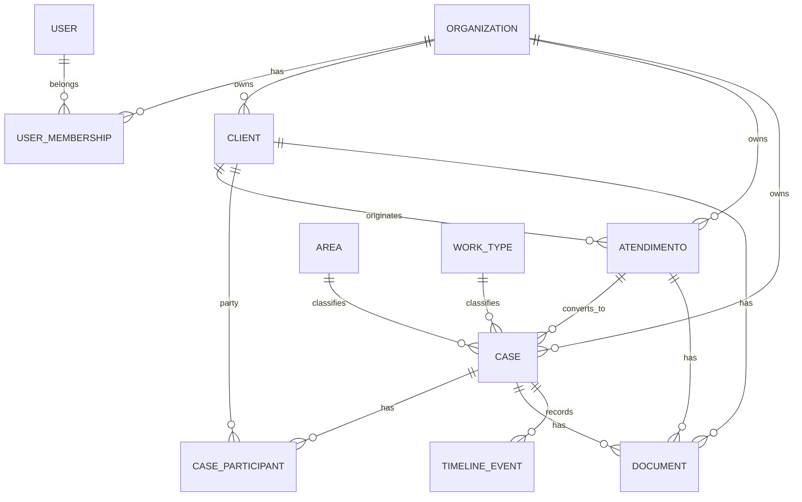

# Data Model — Núcleo Operacional

> **Modelo lógico (PostgreSQL + Drizzle), sob custódia local** (ADR-0021). As entidades
> operacionais (`clients`, `atendimentos`, `cases`) são **tenant-aware**: `organization_id`
> é **obrigatório** (decisão do MACRO PACOTE 012) e **materializado** no schema Drizzle
> (MACRO PACOTE 013), com FKs para `organizations`, índices por organização e **unicidade
> documental parcial por organização** (`(organization_id, cpf|cnpj) WHERE ... is not null`).
> `Organization` é conceito do **Core**; o isolamento ocorre **dentro** do ambiente do
> cliente e uma instalação **não** é obrigatoriamente mono-organização. Convenções: `id`
> UUIDv7, `timestamptz` UTC, `created_at`/`updated_at`, `archived_at` onde há arquivamento,
> `deleted_at` **apenas** onde a exclusão lógica for realmente necessária.
>
> **Estado de materialização:** migrações `0000` (organizations), `0001`
> (clients/atendimentos/cases) e `0002` (identidade/autenticação: `users`,
> `organization_memberships`, `platform_identities`, `credentials`, `sessions`) **aplicadas
> e verificadas em PostgreSQL descartável** (MP-013 e MP-014), com FKs, índices e uniques
> (`users_email`, `(organization_id,user_id)`, `credentials(subject_type,subject_id)`,
> `sessions.token_hash`, `platform_identities.kind` singleton do Criador). Papel só no
> membership; credencial guarda apenas hash Argon2id; sessão guarda apenas o hash do token.

## Diagrama ER (Mermaid)

## Tabelas (resumo lógico — provisório)

### organizations
PK `id`; `name`, `status`; timestamps. Conceito de **escopo organizacional do Core**
(isolamento dentro do ambiente do cliente).

### users
PK `id`; `name`, `email` (único local, `citext`), `password_hash`, `status`; timestamps.

### organization_memberships
PK `id`; FK `organization_id`, FK `user_id`; `role` (`owner|lawyer|assistant`);
UNIQUE(`organization_id`,`user_id`). Índice por `organization_id`.

### clients
PK `id`; FK `organization_id`; `person_type` (`pf|pj`); `display_name`;
`cpf` (nullable), `cnpj` (nullable); `archived_at?`; timestamps.
- UNIQUE **parcial**: `(organization_id, cpf) WHERE cpf IS NOT NULL`; idem `cnpj`.
- Índices: `organization_id`, `display_name`.

### contacts / addresses
FK `organization_id`, FK `client_id?`; contatos (`type` configurável, `value` —
múltiplos, sem lista rígida de plataformas), endereços. Reutilizáveis (Captura Única).

### atendimentos
PK `id`; FK `organization_id`; FK `client_id?`; `channel_origin`; FK `area_id?`,
FK `work_type_id?`; `status`; `result?`; `non_conversion_reason?`; `converted_at?`; `assigned_user_id`;
`summary` (texto curto — sem constraint rígida de tamanho, ver NFR/UX); `conflict_flag`;
`first_contact_at`; `last_relevant_interaction_at`; `discard_eligible_at` (derivado:
`last_relevant_interaction_at + 30d`); `discarded_at?`; `discarded_by?`; `anonymized_at?`.
- Índices: `organization_id`, `status`, `last_relevant_interaction_at`.
- **Conversão em Cliente (explícita):** define `client_id`, `converted_at` e `status`/`result` = convertido; segunda conversão é rejeitada; a origem do Caso é preservada por `cases.atendimento_id`. `Lead` = atendimento em recepção (sem entidade separada).
- Após descarte: PII e `summary` removidos/anonimizados; métricas anonimizadas preservadas.

### cases
PK `id`; FK `organization_id`; FK `atendimento_id?`; FK `area_id`, FK `work_type_id`;
`status`; `financial_classification`; `process_number?` (Caso pode não ter processo);
`title`; `archived_at?`; timestamps.
- Índices: `organization_id`, `status`, `area_id`.
- Sem `deleted_at` (histórico jurídico não é excluído; usa `archived_at`).

### case_participants
PK `id`; FK `organization_id`; FK `case_id`; `party_ref` (client/contact); `role`
(controlado); `is_primary?`; timestamps. UNIQUE(`case_id`,`party_ref`,`role`).

### areas / work_types (catálogos)
PK `id`; FK `organization_id`; `name`; `active`; `sort_order`. Configuráveis; não
excluíveis com histórico (proteção via FK/constraint aplicacional).

### documents
PK `id`; FK `organization_id`; FK `client_id?`/`case_id?`/`atendimento_id?`; `category`;
`original_name`; `physical_key`; `content_hash`; `size`; `mime`; `version`;
`confidentiality`; timestamps; `deleted_at?` (descarte controlado).
- Integridade: `content_hash` obrigatório; `physical_key` nunca é identidade.

### timeline_events
PK `id`; FK `organization_id`; FK `case_id`; `type`; `payload` (mínimo); `created_by`;
`created_at`. Append.

### audit_logs
PK `id`; FK `organization_id`; `actor_user_id`; `entity`, `entity_id`; `action`;
`before?`/`after?` (mínimos, sem conteúdo jurídico integral); `origin`; `result`;
`correlation_id`; `created_at`. **Append-only**; sem update/delete pelo fluxo comum.

### commercial_metrics (anonimizado) — estratégia
Recomendação MVP: **anonimização in-place** do `atendimento` (remover PII, manter
campos comerciais anonimizados) em vez de tabela estatística separada (`[ADIADA — JIT]`).

## Integridade, catálogos e separação Core/módulos
Constraints de banco como defesa (FKs, uniques parciais, checks de enum); catálogos
como **tabelas configuráveis** (não enums de código). As tabelas de **módulo** (áreas/
especialidades — ADR-0020) **não duplicam** as entidades do Core acima; serão definidas
por módulo na etapa correspondente.

## Escopo organizacional (Core)
`Organization` é conceito do **Core** (ADR-0020). Onde houver dados a isolar, o escopo
organizacional (ex.: `organization_id` + filtro na consulta) ocorre **dentro do ambiente
do cliente** — **não** há multitenancy de servidor controlado pela Britus (ADR-0017
Superseded / ADR-0021). A materialização (colunas, constraints, testes de isolamento) é
**decidida na Etapa 3+**; não se impõe nem se elimina agora.
